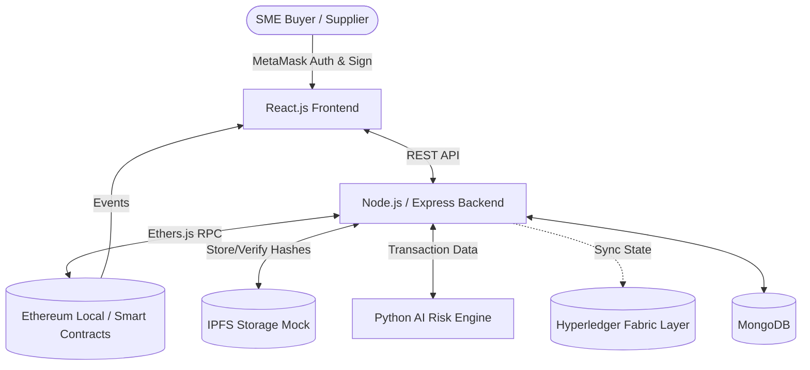

# 1. CrossPay: Blockchain-Enabled Cross-Border Payment System for SMEs

A decentralized payment platform minimizing transaction costs, settlement delays, and fraud in international SME payments using blockchain and smart contracts.

# 2. Abstract

Traditional cross-border SME payments suffer from high transaction fees, extended settlement delays, and counterparty risks. **CrossPay** introduces a decentralized solution utilizing Ethereum-based smart contracts for automated escrow and payment milestones. By integrating MetaMask for secure wallet authentication, IPFS for immutable trade document storage, and an AI Risk Engine for fraud detection, the platform ensures transparent, tamper-evident, and efficient international trade settlements. Hyperledger Fabric is conceptually integrated as an enterprise ledger layer for institutional auditing.

# 3. Problem Statement

International trade for Small and Medium Enterprises (SMEs) faces significant challenges:
* **High transaction costs:** Multiple intermediary banks and correspondent fees.
* **Settlement delays:** Cross-border transfers can take several days to clear.
* **Intermediaries:** Dependence on centralized financial institutions.
* **Limited transparency:** Opaque tracking of payment status and routing.
* **Fraud/counterparty risk:** High risk of non-payment or failure to deliver goods.
* **Manual document/payment verification:** Letters of Credit and trade documents are manually verified, leading to bottlenecks.

# 4. Existing Solution

The traditional workflow relies on the SWIFT network and correspondent banking. An SME initiates a wire transfer or requests a Letter of Credit from their local bank. The funds pass through multiple intermediary banks across different jurisdictions, each taking a fee and adding processing time. Verification of shipping documents is handled manually by the banks before funds are released, which is slow, expensive, and prone to disputes.

# 5. Proposed Solution

**CrossPay** modernizes this workflow using decentralized technologies:
* **Ethereum & Solidity:** Smart contracts act as programmable escrow, holding funds securely until predefined conditions (like document verification) are met.
* **MetaMask:** Enables secure, cryptographic signing of transactions by buyers and suppliers.
* **IPFS:** Decentralized storage for invoices and shipping documents, generating verifiable cryptographic hashes.
* **Hyperledger Fabric (Demo Integration):** Represents a permissioned enterprise ledger for private, regulatory-compliant auditing.
* **AI Risk Engine:** A machine learning service that analyzes payment data for anomalies, generating real-time risk scores for fraud monitoring.

# 6. System Architecture



# 7. System Workflow

1. **Payment Creation:** SME Buyer initiates a cross-border payment agreement.
2. **Smart Contract Escrow:** Funds are securely locked in a Solidity smart contract.
3. **Supplier Acceptance:** Supplier views the active escrow and processes the order.
4. **Documents Uploaded:** Supplier uploads trade/shipping documents. The files are hashed and stored on IPFS.
5. **Blockchain Verification:** The IPFS hash is registered on the blockchain for tamper-evident verification.
6. **Funds Released:** Upon milestone approval or successful document verification, the smart contract automatically releases the escrowed funds to the supplier's wallet.
7. **Transaction Recorded:** The completion is recorded immutably on the ledger.

# 8. Requirements

### Functional Requirements
* **Wallet Connection:** Web3 wallet (MetaMask) integration for secure access.
* **Payment Creation:** Interface to define payment amounts, currencies, and counterparties.
* **Escrow Management:** Smart contract locking and releasing of funds.
* **Document Management:** Uploading trade documents to IPFS.
* **Blockchain Verification:** Cryptographic verification of document integrity.
* **Risk Monitoring:** AI-driven anomaly detection and risk scoring.
* **Admin Monitoring:** Overview of system health and enterprise ledger status.

### Non-Functional Requirements
* **Security:** Cryptographic signing and secure smart contract execution.
* **Transparency:** All payment events are publicly verifiable on the ledger.
* **Reliability:** Immutable transaction history.
* **Usability:** Intuitive, modern fintech UI abstracting blockchain complexity.

# 9. Technology Stack

| Technology | Purpose |
| --- | --- |
| **React.js** | Interactive frontend UI and web3 integration. |
| **Node.js & Express** | Backend API, blockchain interaction, and data routing. |
| **Solidity** | Smart contract logic for escrow and payment state management. |
| **Ethereum / Hardhat** | Local blockchain network for contract deployment and testing. |
| **MetaMask** | Cryptographic wallet for user authentication and transaction signing. |
| **IPFS** | Decentralized storage (mocked via MongoDB) for trade documents. |
| **Python / FastAPI** | AI Risk Engine serving machine learning fraud detection models. |
| **MongoDB** | Off-chain database for caching and fast querying. |
| **Hyperledger Fabric** | Conceptually integrated for permissioned enterprise auditing. |

# 10. Project Structure

```text
CrossPay/
├── frontend/             # React application (UI, Web3 context, Components)
├── backend-node/         # Express API (Ethers.js integration, MongoDB models)
├── contracts/            # Solidity smart contracts (SeedChain/EventChain adapted for payments)
├── scripts/              # Hardhat deployment scripts
├── ai-service/           # Python FastAPI risk engine
├── artifacts/            # Compiled smart contract ABIs
└── README.md             # Project documentation
```

# 11. Smart Contract Design

The system utilizes modular smart contracts to handle the payment lifecycle:

| Contract | Purpose |
| --- | --- |
| **Payment Escrow (SeedChain)** | Manages the creation, funding, splitting (milestones), and final transfer of payment batches. |
| **Document Registry (EventChain)** | Registers IPFS hashes of trade documents, linking them to specific payment batches for verification. |

**Key States:** `Pending`, `Funded`, `In Progress`, `Completed`, `Refunded`.

# 12. IPFS

IPFS is utilized to ensure the immutability of trade documents (invoices, Bill of Lading). When a document is uploaded, it generates a unique CID (hash). This hash is stored on the Ethereum blockchain. Any subsequent verification checks the document against this on-chain hash to detect tampering. *(Note: Currently implemented via a functional mock within the backend for demo reliability).*

# 13. MetaMask

MetaMask acts as the identity and authorization layer. Users connect their wallets to access the dashboard. All state-changing operations (creating a payment, releasing funds) require the user to cryptographically sign the transaction via MetaMask before it is broadcasted to the Hardhat network.

# 14. Hyperledger Fabric

Hyperledger Fabric acts as a secondary, permissioned enterprise ledger. While Ethereum handles the trustless public escrow between untrusted SMEs, Fabric is designed to sync finalized transactions for institutional auditing and regulatory compliance.

**Note:** In this prototype, Hyperledger Fabric is represented as an integration layer and simulated in the admin dashboard; it is not a fully deployed production Fabric network.

# 15. API / Backend

Key Express.js REST endpoints:
* `GET /batches` - Retrieve all payment agreements.
* `POST /batches` - Create a new payment (initiates blockchain tx).
* `POST /batches/:id/transfer` - Release funds to supplier.
* `POST /certificates` - Register a trade document (IPFS hash to blockchain).
* `GET /certificates/verify/:id` - Verify document integrity.
* `GET /events` - Retrieve chronological blockchain events.
* `GET /dashboard-metrics` - Fetch aggregated stats for the dashboard.

# 16. Security

* **Smart Contract Security:** Standard access control modifiers are used. Only the owner of an escrow can release the funds.
* **Immutable Records:** Once a payment or document hash is recorded on-chain, it cannot be altered or deleted.
* **Limitations:** The current smart contracts are designed for prototype demonstration and have not undergone a formal security audit. They currently operate on a local testnet.

# 17. Installation & Running

### Prerequisites
* Node.js (v16+)
* Python 3.8+
* MetaMask browser extension

### Setup
```bash
# 1. Start Local Blockchain
npx hardhat node

# 2. Deploy Contracts
npx hardhat run scripts/deploy.js --network localhost

# 3. Start Backend
cd backend-node
npm install
npm start

# 4. Start AI Risk Engine
cd ai-service
pip install -r requirements.txt
python -m uvicorn app:app --port 5000

# 5. Start Frontend
cd frontend
npm install --legacy-peer-deps
npm start
```

# 18. Testing

Smart contract logic can be tested using Hardhat's built-in testing framework:
```bash
npx hardhat test
```
*Tests cover payment creation, fund transfers, and document registration.*

# 19. Existing vs Proposed

| Aspect | Existing Approach | Proposed System (CrossPay) |
| --- | --- | --- |
| **Settlement** | Intermediary-based (SWIFT) | Blockchain-assisted (Direct) |
| **Escrow** | External (Letters of Credit) | Smart contract automated |
| **Documents** | Centralized/manual verification | IPFS & Blockchain verification |
| **Transparency** | Limited | Blockchain-verifiable |
| **Automation** | Highly manual | Smart contract execution |
| **Auditability** | Fragmented across banks | On-chain chronological events |

# 20. Benefits

* **Reduced payment friction:** Eliminates correspondent banking layers.
* **Faster settlement:** Transactions process in seconds/minutes once conditions are met.
* **Automated execution:** Smart contracts enforce payment terms without human intervention.
* **Transparency:** Both buyer and supplier have real-time visibility into funds.
* **Tamper-evident documents:** Cryptographic hashing prevents document forgery.
* **Fraud/risk monitoring:** AI analyzes patterns to flag anomalous behavior.

# 21. Limitations

* The system currently operates on a local Hardhat test network.
* Escrow deals with nominal token values rather than live fiat-backed stablecoins.
* IPFS and Hyperledger Fabric components are partially mocked to ensure reliable demonstration capabilities.

# 22. Future Enhancements

* **Stablecoin Integration:** Support for USDC/USDT for real-world fiat value transfer.
* **Multi-chain support:** Deploying on Layer-2 solutions (Polygon, Arbitrum) for lower gas fees.
* **Production Fabric Network:** Full deployment of the enterprise auditing layer.
* **KYC/AML Oracles:** Integrating Chainlink oracles for identity and compliance checks.
* **Advanced Fraud Detection:** Expanding the AI model with broader dataset training.

# 23. Conclusion

CrossPay successfully demonstrates how decentralized technologies can streamline international SME trade. By replacing traditional, opaque correspondent banking workflows with programmable smart contract escrow, IPFS document verification, and AI risk monitoring, the platform significantly reduces friction, latency, and counterparty risk in cross-border payments.
